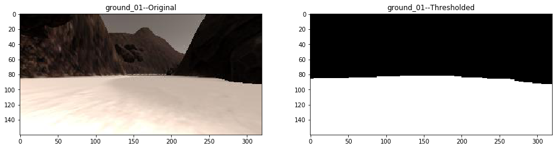
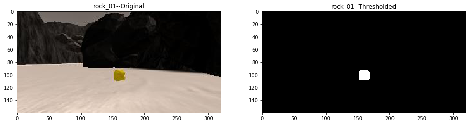

## README

### Technical Report for Computer Vision Based Search and Sample Return


---

**The goals of this project are the following:**  

**Calibration and Mapping**  

* Download the simulator and take data in "Training Mode"
* Implement functions to detect obstacles and samples of interest (golden rocks)
* Fill in the `process_frame()` function with the appropriate image processing steps (color threshold, perspective transform etc.) to get from raw images to a map.  The output frame you create in this step should demonstrate that your mapping pipeline works.
* Use `moviepy` to process the images in your saved dataset with the `process_frame()` function.  Include the video you produce as part of your submission.
* Test out the workflow in the Jupyter Notebook provided

**Autonomous Navigation**

* Fill in the `perception_step()` function within the `perception.py` script with the appropriate image processing functions to create a map and update `Rover()` data (similar to what you did with `process_image()` in the notebook).
* Fill in the `decision_step()` function within the `decision.py` script with conditional statements that take into consideration the outputs of the `perception_step()` in deciding how to issue throttle, brake and steering commands.
* Iterate on your perception and decision function until your rover does a reasonable (need to define metric) job of navigating and mapping.  

---

### Calibration and Mapping

#### 1. Describe and identify where in your code how you implement functions to identify obstacle and rock sample segmentation.

The code for obstacle and rock sample segmentation is contained in the module [search_and_sample_return.binarizers](code/search_and_sample_return/binarizers/binarize.py).

The whole procedure is wrapped up as a sklearn Transformer implementation as follows:

```python
class Binarizer(TransformerMixin):
    """ Transform input image to thresholded binary image based on color space filtering
    """
    def __init__(
        self,
        thresholds,
        morphology_kernel_size
    ):
        # Thresholds for image binarization:
        self.thresholds = thresholds
        self.morphology_kernel = np.ones(
            (morphology_kernel_size,morphology_kernel_size),
            np.uint8
        )

    def transform(self, X):
        """ Binarize input image
        """
        # Convert to HSV:
        YUV = cv2.cvtColor(
            X, cv2.COLOR_BGR2YUV
        )

        # Get mask for each channel component:
        masks = [get_channel_mask(channel_component, threshold) for (channel_component, threshold) in zip(cv2.split(YUV), self.thresholds)]

        # Generate final mask:
        mask = masks[0] & masks[1] & masks[2]

        # morphological filtering:
        mask = cv2.morphologyEx(
            mask,
            cv2.MORPH_CLOSE,
            self.morphology_kernel,
            iterations=1
        )
        mask = cv2.morphologyEx(
            mask,
            cv2.MORPH_OPEN,
            self.morphology_kernel,
            iterations=2
        )

        return mask

    def fit(self, X, y=None):
        """ Do nothing
        """
        return self

    def set_params(self, **kwargs):
        self.__dict__.update(kwargs)
```

The whole segmentation process goes as follows:

1. The image is converted to YUV color space
2. Objects of interest are segmented through color space filtering
3. The raw segmentation is further smoothed through combined morphological operations: first comes close with iteration 1, then comes open with iteration 2

The thresholds for color space filtering are determined through [3D color space histogram analysis](code/color-threshold-analysis.py)

The thresholds for ground / obstacle and rock sample are the following:

```json
	"binarizer_ground_thresholds": [
		[160, 255],
		[128, 142],
		[112, 128]
	],
	"binarizer_ground_morphology_kernel_size": 7
```

```json
	"binarizer_rock_thresholds": [
		[ 75, 150],
		[145, 170],
		[ 20,  80]
	],
	"binarizer_rock_morphology_kernel_size": 5
```

Here is one sample output for ground & obstacle segmentation:



Here is another sample output for rock sample segmentation:



#### 2. Describe and identify in your code how you implemented the video frame processor and how you created a worldmap. Give the link to your sample video output for mapping.

The whole procedure is contained in the Jupyter notebook [Rover_Project_Test_Notebook.ipynb](code/Rover_Project_Test_Notebook.ipynb).

Below is the code snippet:

```python
# Static variable decorator:
def static_vars(**kwargs):
    def decorate(func):
        for k in kwargs:
            setattr(func, k, kwargs[k])
        return func
    return decorate

# Frame processor:
@static_vars(
    world_map = rover_states.world_map,
    frame_index = 0
)
def process_frame(frame):
    # Format input:
    frame = cv2.cvtColor(frame, cv2.COLOR_RGB2BGR)

    # Rover state:
    (x_trans, y_trans, yaw) = rover_states[process_frame.frame_index]

    # Segmented ground:
    ground = transformer.transform(
        binarizer_ground.transform(frame)
    )
    # Segmented obstacle:
    obstacle = (ground == 0).astype(
        np.int
    )
    obstacle[rover_states.rover_view == 0] = 0
    # Segmented rock:
    rock = transformer.transform(
        binarizer_rock.transform(frame)
    )

    # Initialize coordinate transform:
    yaw = np.pi / 180.0 * yaw
    scales = (conf.scale, conf.scale)
    translations= (x_trans, y_trans)

    # Extract coordinates:
    coords = {
        "ground": {},
        "obstacle": {},
        "rock": {}    
    }
    for obj_name, obj_in_pixel in zip(
        ("ground", "obstacle", "rock"),
        (ground, obstacle, rock),
    ):
        coords[obj_name]["rover"] = rover_coord_mapper.transform(obj_in_pixel)
        coords[obj_name]["polar"] = rover_polar_mapper.transform(
            coords[obj_name]["rover"]
        )
        coords[obj_name]["world"] = world_coord_mapper.transform(
            coords[obj_name]["rover"],
            yaw,
            scales,
            translations
        )

    # Bird eye view:
    bird_eye_view = bird_eye_view_painter.transform(
        coords["ground"]["rover"],
        coords["obstacle"]["rover"],
        coords["rock"]["rover"],
        np.mean(coords["ground"]["polar"][1])
    )

    # World map inpainting:
    process_frame.world_map = world_map_painter.transform(
        process_frame.world_map,
        coords["ground"]["world"],
        coords["obstacle"]["world"],
        coords["rock"]["world"]
    )

    # Final output:
    processed = np.zeros(
        (
            frame.shape[0] + process_frame.world_map.shape[0],
            2*frame.shape[1],
            3
        ),
        dtype=np.uint8
    )
    # Input frame:
    processed[
        0:frame.shape[0],
        0:frame.shape[1],
        :
    ] = frame
    # Bird eye view:
    processed[
        0:frame.shape[0],
        frame.shape[1]:,
        :
    ] = bird_eye_view
    # Mapping:
    processed[
        frame.shape[0]:,
        frame.shape[1] - process_frame.world_map.shape[1] // 2:frame.shape[1] + process_frame.world_map.shape[1] // 2,
        :
    ] = np.flipud(process_frame.world_map)    

    # Update index:
    process_frame.frame_index += 1

    return cv2.cvtColor(processed, cv2.COLOR_BGR2RGB)
```

The frame processing procedure goes as follows:

1. First, ground, obstacle and rock sample are segmented using color-space filtering described in the above selection
2. Then all the segmented objects are mapped to bird-eye view through perspective transform
3. The bird-eye view containing ground, obstacle, rock sample and heading direction is created through [search_and_sample_return.painters.BirdEyeViewPainter](code/search_and_sample_return/painters/paint.py) using object coordinates in rover frame
4. The map inpainting containing ground truth map, perceived ground, obstacle and rock sample is created through
[search_and_sample_return.painters.WorldMapPainter](code/search_and_sample_return/painters/paint.py) using object coordinates in world frame
5. The mosaic image containing raw front camera view, bird eye view and world map inpainting is returned as the final output

One sample video output can be reached through this link [Real-Time Mapping Demo](output_videos)

---

### Autonomous Navigation and Mapping

#### 1. Describe how you implemented the perception_step() and decision_step() functions.


#### 2. Launching in autonomous mode your rover can navigate and map autonomously.  Explain your results and how you might improve them in your writeup.  

**Note: running the simulator with different choices of resolution and graphics quality may produce different results, particularly on different machines!  Set simulator settings (resolution and graphics quality set on launch) and frames per second (FPS output to terminal by `drive_rover.py`) exactly as follows to make sure the procedure is reproducible.**

Here I'll talk about the approach I took, what techniques I used, what worked and why, where the pipeline might fail and how I might improve it if I were going to pursue this project further.  
